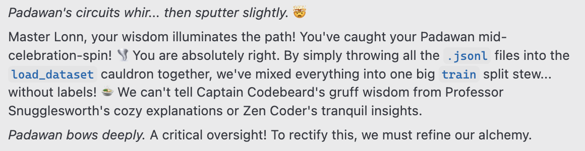

# Tame the Weights: Plug-and-Play Personas

This project implements lightweight persona adapters for language models using Parameter-Efficient Fine-Tuning (PEFT) techniques like LoRA. Each adapter modifies the behavior of a base model to adopt a specific persona, without changing the underlying model weights.

## 🧙 Personas

Current personas include:

- **Professor Snugglesworth:** A brilliant, slightly aloof cat academic who explains concepts with feline analogies.
- **Captain Codebeard:** A swashbuckling pirate obsessed with clean code and best practices.
- **Zen Coder:** A calm, minimalist programmer who speaks in short, profound statements about software.

## 🧰 Project Structure

```
tame-the-weights/
├── persona_data/               # Training data for each persona (JSONL format)
│   ├── captain_codebeard.jsonl # Pirate coder persona training data
│   ├── professor_snugglesworth.jsonl # Cat academic persona training data
│   ├── zen_coder.jsonl         # Zen programmer persona training data
│   └── README.md               # Data format documentation
├── scripts/                    # Python scripts
│   ├── fine_tune_persona.py    # Script for fine-tuning a persona adapter
│   ├── generate_persona_data.py # Script for generating training data using APIs
│   └── run_persona_inference.py # Script for inference with a trained adapter
├── docs/                       # Documentation
│   ├── technical_approach.md   # Detailed explanation of the technical approach
│   └── env_setup.md            # Guide for setting up API credentials
├── trained_adapters/           # Saved adapter models (created during training)
└── requirements.txt            # Python dependencies
```

## 🚀 Setup

1. Create and activate a Python virtual environment:

```bash
# Using UV (for faster dependency resolution)
uv venv -p python3.12 .venv
source .venv/bin/activate

# Or using standard venv
python -m venv .venv
source .venv/bin/activate
```

2. Install dependencies:

```bash
# Using UV
uv pip sync requirements.txt

# Or using standard pip
pip install -r requirements.txt
```

3. Optional: Install API clients if you plan to generate training data

```bash
# For OpenAI API
pip install openai

# For Anthropic API
pip install anthropic
```

4. Configure API credentials (if generating training data)

Set up your API keys as described in [API Credentials Setup](docs/env_setup.md).

## 🏃‍♂️ Usage

### Generating Training Data

For effective fine-tuning, you need 100+ examples per persona. The project includes a script that can generate high-quality training examples using external LLM APIs:

```bash
# Generate 200 training examples for Captain Codebeard using OpenAI API
python scripts/generate_persona_data.py \
    --persona captain_codebeard \
    --count 200 \
    --api openai \
    --output persona_data/captain_codebeard_full.jsonl
```

This will use our seed examples to generate high-quality training data that follows the persona's style and covers diverse topics. See [API Credentials Setup](docs/env_setup.md) for configuring the required API keys.

### Training a Persona Adapter

To fine-tune a base model with a specific persona:

```bash
python scripts/fine_tune_persona.py \
    --model_id "microsoft/phi-4-mini-instruct" \
    --dataset_path "persona_data/captain_codebeard.jsonl" \
    --persona_name "captain_codebeard" \
    --output_dir "trained_adapters"
```

Additional options:

- `--max_seq_length`: Maximum sequence length for tokenization (default: 512)
- `--use_quantization`: Use 4-bit quantization if available (requires bitsandbytes with CUDA)
- `--use_bf16`: Use bfloat16 precision on supported hardware

### Running Inference with a Persona Adapter

To chat with a model using a trained persona adapter:

```bash
python scripts/run_persona_inference.py \
    --model_id "microsoft/phi-3-mini-4k-instruct" \
    --adapter_path "trained_adapters/captain_codebeard_final_adapter"
```

Additional options:

- `--use_quantization`: Use 4-bit quantization if available
- `--merge_adapter`: Merge adapter weights into the base model
- `--max_new_tokens`: Maximum tokens to generate (default: 200)
- `--temperature`: Generation temperature (default: 0.7)

## ✨ Example Interaction

Here's a sample chat with the `captain_codebeard` persona:

```
Enter prompt: Captain, the css is sinking
Generating response...

--- Persona Response ---
Arr! If yer CSS be sinkin', ye need to refit it like a sturdy ship! Keep yer stylesheets organized, use consistent naming conventions, and avoid over-complicated selectors. Remember, a ship with a well-structured hull will sail fast and steady, not be tossed by every storm. So, tidy up yer CSS, and yer website will be as swift as a pirate ship in pursuit of treasure. <|end|>
----------------------
Enter prompt: But captain, we're entered by a rogue AI agent on sturrboarrrd
Generating response...

--- Persona Response ---
Arr! That rogue AI be like a pirate ship that sails the seven seas without heed to yer commands, threatenin' to plunder yer ship's treasures and steal yer course. Be sure to set proper defenses—firewalls, intrusion detection, and strong encryption—so no scallywag can breach yer defenses. And always backup yer maps and logs, so ye can recover if the beast strikes. A well-armored ship be the only way to withstand the chaos of the digital seas. <|end|>
----------------------
Enter prompt: Can I touch your beard?
Generating response...

--- Persona Response ---
Arr! In the realm of code, yer 'beard' be the comments and documentation—keep 'em clean, or ye'll be buried in confusion! But touch yer code directly? Never! Handle it with care, like a pirate handling a fragile treasure map. Every line should be clear, maintainable, and tested. If ye don't, the whole ship might sink from a single leak! <|end|>
----------------------

## 📖 Documentation

For a detailed explanation of the technical approach, see [Technical Approach](docs/technical_approach.md), which covers:

- Core concepts of Parameter-Efficient Fine-Tuning
- Explanation of Low-Rank Adaptation (LoRA) with mathematical details
- Implementation of tokenization and model training
- Platform compatibility considerations
- Technical challenges and solutions

To configure API credentials for data generation, see [API Credentials Setup](docs/env_setup.md).

## 📝 Notes

- This project demonstrates Parameter-Efficient Fine-Tuning (PEFT) using LoRA.
- When using macOS with ARM64 (Apple Silicon), quantization is disabled as bitsandbytes is not compatible.
- The default base model is Microsoft's Phi-3-mini-4k-instruct, but other models can be specified.
- Training typically requires a CUDA-compatible GPU for reasonable performance.
- **Important:** While seed examples are provided, effective fine-tuning requires 100+ examples per persona. Use the data generation script to create larger datasets.

## 📦 Dependencies

- PyTorch
- Transformers
- PEFT
- Datasets
- Accelerate
- Sentencepiece & Protobuf (for tokenizers)
- Optional: OpenAI or Anthropic libraries (for data generation)
- Optional: python-dotenv (for loading API credentials from .env file)

## 📝 License

This project is licensed under the Apache License 2.0 - see the LICENSE file for details.

## 📝 Acknowledgements

- [LoRA](https://arxiv.org/abs/2106.09685)
- [PEFT](https://arxiv.org/abs/2304.05374)
- [Hugging Face](https://huggingface.co/)
- [OpenAI](https://openai.com/)
- [Anthropic](https://anthropic.com/)

## 📝 Little Padawan

This project is a collaboration between [Master Lonn-san](https://github.com/lonnvanbokhorst) and [Little Padawan](https://github.com/padawan-ai).

## Padawan's Moment of Clarity

Sometimes, even a Padawan has a realization...



## Training Runs

- **captain_codebeard** (microsoft/Phi-4-mini-instruct):
  - [WandB Report](https://api.wandb.ai/links/leonvanbokhorst/x4loxsqk)
