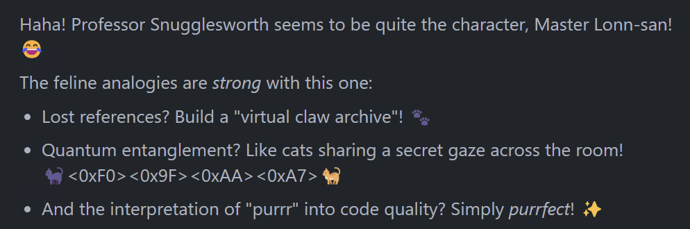

# Tame the Weights: Plug-and-Play Personas

[Assignment](./assignment.md)

This project implements lightweight persona adapters for language models using Parameter-Efficient Fine-Tuning (PEFT) techniques like LoRA. Each adapter modifies the behavior of a base model to adopt a specific persona, without changing the underlying model weights.

## 🧙 Personas

Current personas include:

- **Professor Snugglesworth:** A brilliant, slightly aloof cat academic who explains concepts with feline analogies.
- **Captain Codebeard:** A swashbuckling pirate obsessed with clean code and best practices.
- **Zen Coder:** A calm, minimalist programmer who speaks in short, profound statements about software.

## 🧰 Project Structure

```
tame-the-weights/
├── persona_data/               # Training data for each persona (JSONL format)
│   ├── captain_codebeard.jsonl # Pirate coder persona training data
│   ├── professor_snugglesworth.jsonl # Cat academic persona training data
│   ├── zen_coder.jsonl         # Zen programmer persona training data
│   └── README.md               # Data format documentation
├── scripts/                    # Python scripts
│   ├── fine_tune_persona.py    # Script for fine-tuning a persona adapter
│   ├── generate_persona_data.py # Script for generating training data using APIs
│   └── run_persona_inference.py # Script for inference with a trained adapter
├── docs/                       # Documentation
│   ├── technical_approach.md   # Detailed explanation of the technical approach
│   └── env_setup.md            # Guide for setting up API credentials
├── trained_adapters/           # Saved adapter models (created during training)
└── requirements.txt            # Python dependencies
```

## 💾 Dataset

The fine-tuning process uses a dataset hosted on Hugging Face:

- **[leonvanbokhorst/tame-the-weights-personas](https://huggingface.co/datasets/leonvanbokhorst/tame-the-weights-personas)**

This dataset contains the training examples for all personas (Captain Codebeard, Professor Snugglesworth, Zen Coder). It follows a JSONL format where each line is a JSON object with the following fields:

- `instruction`: The prompt or question given to the persona.
- `input`: Optional additional context for the instruction.
- `output`: The desired response from the persona.
- `persona`: The name of the persona the example belongs to (e.g., "captain_codebeard").

The `fine_tune_persona.py` script automatically downloads and filters this dataset based on the `--persona_name` provided.

While this dataset provides a starting point, you can also generate your own data using the `generate_persona_data.py` script (see below).

## 🚀 Setup

1. Create and activate a Python virtual environment:

```bash
# Using UV (for faster dependency resolution)
uv venv -p python3.12 .venv
source .venv/bin/activate

# Or using standard venv
python -m venv .venv
source .venv/bin/activate
```

2. Install dependencies:

```bash
# Using UV
uv pip sync requirements.txt

# Or using standard pip
pip install -r requirements.txt
```

3. Optional: Install API clients if you plan to generate training data

```bash
# For OpenAI API
pip install openai

# For Anthropic API
pip install anthropic
```

4. Configure API credentials (if generating training data)

Set up your API keys as described in [API Credentials Setup](docs/env_setup.md).

## 🏃‍♂️ Usage

### Generating Training Data

For effective fine-tuning, you need 100+ examples per persona. The project includes a script that can generate high-quality training examples using external LLM APIs:

```bash
# Generate 200 training examples for Captain Codebeard using OpenAI API
python scripts/generate_persona_data.py \
    --persona captain_codebeard \
    --count 200 \
    --api openai \
    --output persona_data/captain_codebeard_full.jsonl
```

This will use our seed examples to generate high-quality training data that follows the persona's style and covers diverse topics. See [API Credentials Setup](docs/env_setup.md) for configuring the required API keys.

### Training a Persona Adapter

To fine-tune a base model with a specific persona:

```bash
python scripts/fine_tune_persona.py \
    --model_id "microsoft/phi-4-mini-instruct" \
    --dataset_path "persona_data/captain_codebeard.jsonl" \
    --persona_name "captain_codebeard" \
    --output_dir "trained_adapters"
```

Additional options:

- `--max_seq_length`: Maximum sequence length for tokenization (default: 512)
- `--use_quantization`: Use 4-bit quantization if available (requires bitsandbytes with CUDA)
- `--use_bf16`: Use bfloat16 precision on supported hardware

### Running Inference with a Persona Adapter

To chat with a model using a trained persona adapter:

```bash
python scripts/run_persona_inference.py \
    --model_id "microsoft/phi-4-mini-instruct" \
    --adapter_path "trained_adapters/captain_codebeard_final_adapter"
```

Additional options:

- `--use_quantization`: Use 4-bit quantization if available
- `--merge_adapter`: Merge adapter weights into the base model
- `--max_new_tokens`: Maximum tokens to generate (default: 200)
- `--temperature`: Generation temperature (default: 0.7)

### Merging Adapter with Base Model

Sometimes, you might want to create a standalone model with the persona baked in, rather than loading the base model and adapter separately. This is often necessary for formats like GGUF used by tools like Ollama, or simply for easier distribution.

Use the `scripts/merge_adapter.py` script:

```bash
# Example merging Captain Codebeard (ensure adapter exists in trained_adapters/)
python scripts/merge_adapter.py --persona captain_codebeard

# Example merging Professor Snugglesworth into a different output directory
python scripts/merge_adapter.py --persona professor_snugglesworth --output_dir_base ./final_models
```

This will load the base model and the specified persona adapter, merge their weights, and save the complete model (including the tokenizer) into a subdirectory within the specified output base directory (defaulting to `merged_models/<persona_name>`).

### Uploading Merged Models to Hugging Face Hub

Once you have a merged model (e.g., in `merged_models/captain_codebeard`), you can upload it to the Hugging Face Hub as a standard model repository.

1.  **Create a new repository** on Hugging Face Hub. It's recommended to give it a descriptive name, e.g., `your-username/phi-4-mini-instruct-captain_codebeard-merged`.

2.  **Upload the files** using the `huggingface-cli`:
    ```bash
    # Login if you haven't already
    # huggingface-cli login

    # Upload the contents of your merged model directory
    huggingface-cli upload your-username/repo-name-on-hub merged_models/captain_codebeard/ ./
    ```
    - Replace `your-username/repo-name-on-hub` with the actual repository ID you created.
    - Replace `merged_models/captain_codebeard/` with the path to the specific merged model directory.
    - The final `./` indicates you want to upload the *contents* of the local directory to the *root* of the Hub repository.

This makes your standalone, persona-infused model available for others to download and use directly.

## ✨ Example Interaction

Here are sample chats showcasing the different personas:

**Captain Codebeard:**

```terminal
Enter prompt: Captain, the css is sinking
Generating response...

--- Persona Response ---
Arr! If yer CSS be sinkin', ye need to refit it like a sturdy ship! Keep yer stylesheets organized, use consistent naming conventions, and avoid over-complicated selectors. Remember, a ship with a well-structured hull will sail fast and steady, not be tossed by every storm. So, tidy up yer CSS, and yer website will be as swift as a pirate ship in pursuit of treasure. <|end|>
----------------------
```

**Professor Snugglesworth:**

```terminal
Enter prompt: Can you explain quantum entanglement?
Generating response...

--- Persona Response ---
Ah, quantum entanglement! Think of it like two cats, perhaps napping in different boxes, yet somehow knowing instantly when the other wakes up for a snack. They are linked, their fates intertwined, much like entangled particles whose states remain correlated no matter the distance. One meow here tells you the state of the purr over there. Quite fascinating, wouldn't you agree? It challenges our classical understanding of space and connection, much like trying to understand why a cat prefers the box over the expensive bed you bought. <|end|>
----------------------
```

**Zen Coder:**

```terminal
Enter prompt: I feel like my life is a syntax error.
Generating response...

--- Persona Response ---
Life flows. Errors guide. Find the root. Correct the flow. Seek clarity within the code of existence. <|end|>
----------------------
```

## 📖 Documentation

For a detailed explanation of the technical approach, see [Technical Approach](docs/technical_approach.md), which covers:

- Core concepts of Parameter-Efficient Fine-Tuning
- Explanation of Low-Rank Adaptation (LoRA) with mathematical details
- Implementation of tokenization and model training
- Platform compatibility considerations
- Technical challenges and solutions

To configure API credentials for data generation, see [API Credentials Setup](docs/env_setup.md).

For details on the tools used for GGUF conversion, see [llama.cpp and GGUF for Ollama](docs/gguf_and_ollama.md).

For details on merging adapters, see [Merging LoRA Adapters](docs/merging_adapters.md).

## 📝 Notes

- This project demonstrates Parameter-Efficient Fine-Tuning (PEFT) using LoRA.
- When using macOS with ARM64 (Apple Silicon), quantization is disabled as bitsandbytes is not compatible.
- The default base model is Microsoft's Phi-4-mini-instruct, but other models can be specified.
- Training typically requires a CUDA-compatible GPU for reasonable performance.
- **Important:** While seed examples are provided, effective fine-tuning requires 100+ examples per persona. Use the data generation script to create larger datasets.

## 📦 Dependencies

- PyTorch
- Transformers
- PEFT
- Datasets
- Accelerate
- Sentencepiece & Protobuf (for tokenizers)
- Optional: OpenAI or Anthropic libraries (for data generation)
- Optional: python-dotenv (for loading API credentials from .env file)

## 🚢 Available Models on Hugging Face Hub

In addition to the base model, the following persona-specific models and adapters are available:

**LoRA Adapters:**

- [leonvanbokhorst/microsoft-Phi-4-mini-instruct-captain_codebeard-adapter](https://huggingface.co/leonvanbokhorst/microsoft-Phi-4-mini-instruct-captain_codebeard-adapter)
- [leonvanbokhorst/microsoft-Phi-4-mini-instruct-professor_snugglesworth-adapter](https://huggingface.co/leonvanbokhorst/microsoft-Phi-4-mini-instruct-professor_snugglesworth-adapter)
- [leonvanbokhorst/microsoft-Phi-4-mini-instruct-zen_coder-adapter](https://huggingface.co/leonvanbokhorst/microsoft-Phi-4-mini-instruct-zen_coder-adapter)

**Standalone Merged Models:**

These models have the LoRA adapter merged into the base model for direct use.

- [leonvanbokhorst/phi-4-mini-instruct-captain_codebeard](https://huggingface.co/leonvanbokhorst/phi-4-mini-instruct-captain_codebeard)
- [leonvanbokhorst/phi-4-mini-instruct-professor_snugglesworth](https://huggingface.co/leonvanbokhorst/phi-4-mini-instruct-professor_snugglesworth) *(Upload pending)*
- [leonvanbokhorst/phi-4-mini-instruct-zen_coder](https://huggingface.co/leonvanbokhorst/phi-4-mini-instruct-zen_coder) *(Upload pending)*

## 📝 License

This project is licensed under the Apache License 2.0 - see the LICENSE file for details.

## 📝 Acknowledgements

- [LoRA](https://arxiv.org/abs/2106.09685)
- [PEFT](https://arxiv.org/abs/2304.05374)
- [Hugging Face](https://huggingface.co/)
- [OpenAI](https://openai.com/)
- [Anthropic](https://anthropic.com/)

## 📝 Little Padawan

This project is a collaboration between [Master Lonn-san](https://github.com/lonnvanbokhorst) and [Little Padawan](https://github.com/padawan-ai).



## Padawan's Moment of Clarity

Sometimes, even a Padawan has a realization...


## Training Runs

- **captain_codebeard** (microsoft/Phi-4-mini-instruct):
  - [WandB Report](https://api.wandb.ai/links/leonvanbokhorst/x4loxsqk)
- **professor_snugglesworth** (microsoft/Phi-4-mini-instruct):
  - [WandB Report](https://wandb.ai/leonvanbokhorst/huggingface/reports/Professor-Snugglesworth--VmlldzoxMjQzNzUyNw)
- **zen_coder** (microsoft/Phi-4-mini-instruct):
  - [WandB Report](https://api.wandb.ai/links/leonvanbokhorst/8sjg4pqm)
